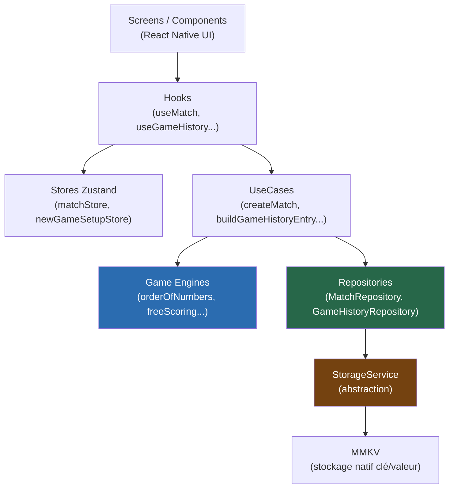

<div align="center">

# 🎱 Billard Score

**Une application de scoring de billard, pensée comme un moteur de jeu extensible plutôt qu'une simple calculatrice.**

[](https://docs.expo.dev/versions/v57.0.0/)
[](https://reactnative.dev/)
[](https://www.typescriptlang.org/)
[](https://github.com/pmndrs/zustand)
[](https://github.com/mrousavy/react-native-mmkv)
[](https://jestjs.io/)
[](./LICENSE)

</div>

---

## Table des matières

- [Présentation](#présentation)
- [Fonctionnalités](#fonctionnalités)
- [Captures d'écran](#captures-décran)
- [Installation](#installation)
- [Scripts disponibles](#scripts-disponibles)
- [Architecture](#architecture)
- [Description de chaque dossier](#description-de-chaque-dossier)
- [Les moteurs de jeu](#les-moteurs-de-jeu)
- [Les UseCases](#les-usecases)
- [Les Repositories](#les-repositories)
- [Les Stores Zustand](#les-stores-zustand)
- [Les Hooks](#les-hooks)
- [Les Components](#les-components)
- [Persistance](#persistance)
- [Tests](#tests)
- [Ajouter un nouveau mode de jeu](#ajouter-un-nouveau-mode-de-jeu)
- [Performance](#performance)
- [Conventions](#conventions)
- [Roadmap](#roadmap)
- [Contribution](#contribution)
- [Licence](#licence)

---

## Présentation

Marquer les points d'une partie de billard semble trivial, jusqu'à ce qu'on essaie de le faire correctement : gérer des modes en solo ou en équipes, appliquer des règles de départage spécifiques à chaque variante (comme la sortie précoce de la boule noire à *l'Ordre des Numéros*), corriger une action passée sans tout recommencer, et retrouver l'historique d'une soirée plusieurs heures après.

**Billard Score** répond à ce problème avec une application mobile Expo/React Native dont le cœur n'est *pas* l'interface, mais un ensemble de **moteurs de jeu** purs et testables. Chaque variante de billard (Ordre des Numéros aujourd'hui, d'autres demain) est un module indépendant qui transforme une liste d'actions en score, sans jamais connaître React, MMKV ou la navigation.

L'objectif du projet est double :

1. Offrir une expérience de marquage fluide, fiable et hors-ligne pendant une partie réelle.
2. Servir de socle propre et évolutif pour ajouter de nouveaux jeux sans risquer de casser les existants.

## Fonctionnalités

- Création de partie guidée (nombre de joueurs → noms → mode d'équipe → jeu)
- Mode solo ou en équipes (2, 3 ou 4 équipes, répartition aléatoire ou manuelle)
- Plusieurs moteurs de jeu, chacun avec ses propres règles de scoring et de fin de partie
- Mode *L'Ordre des Numéros* avec gestion de la boule noire, des bandes et des boules hors-jeu
- Historique complet des actions d'une partie, éditable et annulable (undo, edit, delete)
- Reprise automatique d'une partie en cours après fermeture de l'application
- Historique des parties terminées avec purge automatique après une fenêtre de rétention
- Sauvegarde locale instantanée via MMKV, sans dépendance réseau
- Architecture modulaire : moteurs de jeu, usecases et repositories découplés de l'UI
- Suite de tests unitaires sur la logique métier (moteurs, repositories, stores, utils)
- Thème sombre soigné avec typographies dédiées (Inter / Playfair Display)

## Captures d'écran

| Home | Nouvelle partie | Choix des joueurs |
| :---: | :---: | :---: |
|  |  |  |

| Match | Historique | Paramètres |
| :---: | :---: | :---: |
|  |  |  |

> Les images ci-dessus sont des emplacements à remplacer dans `docs/screenshots/`.

## Installation

### Prérequis

- [Node.js](https://nodejs.org/) ≥ 20
- [npm](https://www.npmjs.com/)
- L'application [Expo Go](https://expo.dev/go) (pour tester sur un appareil physique), ou un émulateur Android / simulateur iOS

### Mise en route

```bash
git clone https://github.com/<votre-organisation>/billard-score-app.git
cd billard-score-app
npm install
npx expo start
```

Le serveur de développement Expo affiche un QR code : scannez-le avec Expo Go, ou choisissez une cible ci-dessous.

### Android

```bash
npm run android
```

Nécessite un émulateur Android démarré (Android Studio) ou un appareil connecté avec le débogage USB activé.

### iOS

```bash
npm run ios
```

Nécessite macOS et Xcode installé, avec un simulateur iOS disponible.

### Web

```bash
npm run web
```

Lance une version web via React Native Web, pratique pour itérer rapidement sur l'UI.

> ⚠️ Le projet cible **Expo SDK 57**. Se référer à la documentation versionnée officielle avant toute modification touchant à Expo : https://docs.expo.dev/versions/v57.0.0/

## Scripts disponibles

| Script | Commande | Description |
| --- | --- | --- |
| `start` | `expo start` | Démarre le serveur de développement Expo (Metro bundler) |
| `android` | `expo start --android` | Lance l'application sur un émulateur/appareil Android |
| `ios` | `expo start --ios` | Lance l'application sur un simulateur/appareil iOS |
| `web` | `expo start --web` | Lance l'application dans un navigateur |
| `lint` | `expo lint` | Analyse statique du code (ESLint, config Expo + tri des imports) |
| `typecheck` | `tsc --noEmit` | Vérifie les types TypeScript sans générer de sortie |
| `format` | `prettier --write .` | Formate l'ensemble du code source |
| `format:check` | `prettier --check .` | Vérifie le formatage sans modifier les fichiers |
| `test` | `jest` | Exécute la suite de tests unitaires (preset `jest-expo`) |

## Architecture

L'application suit une architecture en couches inspirée de la **Clean Architecture** : la logique métier (règles de jeu, calcul de score, persistance) ne dépend d'aucun détail d'implémentation UI, et peut être testée sans monter un seul composant React Native.

Le principe directeur est la **dépendance à sens unique** : l'UI dépend de la logique métier, jamais l'inverse. Un écran peut être réécrit entièrement sans toucher à un moteur de jeu ; un moteur de jeu peut être testé sans qu'aucun écran n'existe.



### Pourquoi ces choix

**Zustand plutôt que Context/Redux.** L'état d'une partie change à haute fréquence (chaque tir) et n'a besoin d'être visible que par quelques écrans (`Match`, `NewGame`, `TeamSetup`). Zustand offre des stores minces, sans provider ni boilerplate d'actions/reducers, avec une sélection de slices fine (`useMatchStore((s) => s.match)`) qui évite les re-renders inutiles — un vrai bénéfice sur mobile.

**MMKV plutôt qu'AsyncStorage.** Les scores doivent survivre à la fermeture de l'app sans latence perceptible : MMKV est un stockage clé/valeur synchrone, natif (JSI), largement plus rapide qu'AsyncStorage. La partie en cours est réécrite en entier à chaque action ; un stockage synchrone évite tout état intermédiaire incohérent.

**Repositories pour isoler le stockage.** Aucun composant, hook ou usecase ne parle directement à MMKV. Les repositories exposent une API métier (`getActiveMatch`, `saveActiveMatch`) au-dessus d'une interface `StorageService` neutre. Changer de backend de stockage — ou injecter un stockage en mémoire pour les tests — ne modifie aucun appelant.

**Game engines indépendants.** Chaque variante de billard a ses propres règles de fin de partie et de départage (voir la résolution du vainqueur à la boule noire dans *l'Ordre des Numéros*). Isoler ces règles dans un module conforme à une interface commune (`GameEngine<TState>`) garantit qu'ajouter un jeu ne touche jamais aux règles d'un autre, et rend chaque moteur testable en pur TypeScript, sans mock.

**UseCases pour orchestrer sans dupliquer.** Des opérations comme "terminer une partie et l'archiver dans l'historique" impliquent plusieurs couches (moteur de jeu, repository de match, repository d'historique). Les usecases encapsulent cette orchestration une seule fois, pour que les hooks restent de simples ponts vers l'UI.

## Description de chaque dossier

| Dossier | Rôle | Responsabilité |
| --- | --- | --- |
| `src/models` | Types de domaine | Définit les entités partagées (`Match`, `MatchAction`, `Player`, `Team`, `GameType`, `GameHistoryEntry`) sans aucune logique. `MatchAction` reste volontairement générique (`type: string`, `payload?: Record<string, unknown>`) : c'est au moteur de jeu actif d'interpréter son contenu. |
| `src/gameEngines` | Règles du jeu | Contient un moteur par variante de billard, tous conformes à l'interface `GameEngine`, plus un `registry.ts` qui résout le moteur actif à partir d'un `gameTypeId`. |
| `src/usecases` | Orchestration métier | Fonctions pures qui combinent modèles, moteurs et repositories pour réaliser une action métier complète (créer une partie, générer des équipes, archiver un historique). Ne connaissent ni React ni la navigation. |
| `src/repositories` | Accès aux données | Encapsulent la lecture/écriture de `Match` et `GameHistoryEntry` derrière une interface, au-dessus de l'abstraction `StorageService`. |
| `src/storage` | Persistance bas niveau | Implémentation concrète (`MmkvStorageService`), interface `StorageService`, helpers de sérialisation JSON (`readJson`/`writeJson`) et clés de stockage centralisées. |
| `src/store` | État global éphémère | Stores Zustand pour l'état vivant de l'application : la partie en cours (`matchStore`) et l'assistant de création de partie (`newGameSetupStore`). |
| `src/hooks` | Pont React ↔ métier | Hooks qui composent stores, usecases et repositories en une API prête à consommer par les écrans (`useMatch`, `useGameHistory`, `useTeamSetup`...). |
| `src/screens` | Écrans de navigation | Un dossier par route de `RootNavigator` ; assemblent des composants et consomment des hooks, sans logique métier propre. |
| `src/components` | UI réutilisable | Composants présentation, organisés par domaine fonctionnel (`common`, `game`, `score`, `teams`, `history`, `players`, `balls`). |
| `src/navigation` | Routage | Déclare la pile de navigation (`RootNavigator`) et le typage des routes (`RootStackParamList`). |
| `src/theme` | Design system | Couleurs, typographies, espacements, ombres — source unique de vérité visuelle. |
| `src/constants` | Constantes statiques | Données de configuration (jeux disponibles, couleurs d'équipes, fenêtre de rétention de l'historique...), séparées des règles de jeu elles-mêmes. |
| `src/utils` | Fonctions pures transverses | Utilitaires sans état ni dépendance métier (`arrayUtils`, `dateUtils`, `idUtils`, `matchSelectors`, `validation`). |
| `src/animations` | Transitions UI | Presets d'animation Reanimated/React Navigation (transitions d'écran, effets de liste, pression tactile). |
| `src/testUtils` | Aides aux tests | Doubles de test partagés, comme `InMemoryStorageService` pour tester les repositories sans MMKV réel. |

## Les moteurs de jeu

Un `GameEngine` est une machine à états pure : il **reçoit un état**, **applique une action**, et **retourne un nouvel état** — sans jamais muter l'existant ni produire d'effet de bord.

```ts
export interface GameEngine<TState = unknown> {
  gameTypeId: string;
  createInitialState(entries: ScoreEntry[]): TState;
  applyAction(state: TState, action: MatchAction): TState;
  getScores(state: TState): Record<string, number>;
  getCurrentEntryId(state: TState): string | undefined;
  getResult(state: TState): GameResult;
  describeAction(action: MatchAction, entries: ScoreEntry[]): string;
  isActionEditable(action: MatchAction): boolean;
}
```

Le hook `useMatch` illustre l'usage de ce contrat : l'état courant de la partie n'est **jamais stocké tel quel**, il est **recalculé** à chaque rendu en rejouant l'historique complet des actions à travers le moteur actif :

```ts
const gameState = match.actions.reduce(
  (state, action) => engine.applyAction(state, action),
  engine.createInitialState(scoreEntries),
);
```

Cette approche façon *event sourcing* a un avantage direct : éditer ou supprimer une action passée (par exemple corriger le nombre de bandes d'une boule noire) suffit à recalculer un état cohérent, sans code de correction spécifique.

`src/gameEngines/registry.ts` résout le moteur actif à partir du `gameTypeId` de la partie, et retombe sur `freeScoringEngine` (score libre, sans règle) si aucun moteur n'est enregistré pour ce jeu — un filet de sécurité qui évite tout crash tant qu'un jeu n'a pas encore ses règles réelles.

Le moteur `orderOfNumbers` est le plus complet : il gère l'ordre des boules 1 à 15, les boules retirées hors-jeu, le nombre de bandes joué sur la boule noire, et deux règles de départage distinctes selon que la noire sort en dernière boule (fin normale) ou prématurément (élimination du joueur, victoire du meilleur score restant).

## Les UseCases

Les usecases sont des **fonctions pures** qui orchestrent modèles, moteurs et repositories pour réaliser une action métier de bout en bout, indépendamment de React. Ils rendent les hooks triviaux et testables : le hook se contente d'appeler un usecase et de brancher le résultat sur un store.

| UseCase | Rôle |
| --- | --- |
| `createMatch` | Construit un `Match` neuf à partir des joueurs, équipes et du jeu choisi lors de l'assistant de création. |
| `buildGameHistoryEntry` | Assemble une entrée d'historique à partir d'un `Match` terminé et du score final calculé par le moteur actif. |
| `generateTeams` | Répartit les joueurs en équipes équilibrées, avec option de tirage aléatoire. |
| `cleanupExpiredHistory` | Purge les entrées d'historique plus anciennes que la fenêtre de rétention. |
| `clearGameHistory` | Vide entièrement l'historique des parties (action de paramètres). |

## Les Repositories

Les repositories encapsulent **où** et **comment** une donnée est stockée, pour que le reste de l'application ne manipule que des concepts métier (`Match`, `GameHistoryEntry`) plutôt que des clés/valeurs sérialisées.

```ts
export interface MatchRepository {
  getActiveMatch(): Match | undefined;
  saveActiveMatch(match: Match): void;
  clearActiveMatch(): void;
}
```

Deux bénéfices concrets de cette indirection :

- **Testabilité** — `MatchRepository.test.ts` instancie `StorageMatchRepository` avec un `InMemoryStorageService` plutôt qu'une vraie base MMKV, ce qui rend les tests instantanés et déterministes.
- **Substituabilité** — un futur backend (sync cloud, SQLite...) ne nécessiterait qu'une nouvelle implémentation de `StorageService`, sans toucher aux repositories ni à leurs appelants.

## Les Stores Zustand

Deux stores couvrent deux responsabilités strictement séparées :

- **`matchStore`** — l'état de la partie *en cours* : le `Match` actif et les actions qui le font évoluer (`recordAction`, `updateAction`, `deleteAction`, `undoLastAction`, `restartMatch`). Il ne connaît ni les règles de jeu (déléguées au moteur actif) ni la persistance (déléguée au `MatchRepository`, orchestrée par `useMatch`).
- **`newGameSetupStore`** — l'état de l'assistant de création de partie (nombre de joueurs, noms, mode d'équipe, répartition des équipes, jeu choisi). Sa portée s'arrête au moment où `createMatch` transforme cette configuration en `Match` réel.

Cette séparation évite qu'un store fourre-tout ne mélange une configuration temporaire (le setup) avec un état durable qui doit être persisté (la partie active).

## Les Hooks

Les hooks encapsulent la logique React (effets, cycle de vie, abonnement aux stores) pour que les écrans restent de purs composants de présentation. Le hook central est `useMatch` : il resynchronise la partie active depuis le `MatchRepository` au montage, persiste automatiquement chaque changement, dérive le score et le joueur courant via le moteur actif, et expose `finishMatch` qui archive la partie dans l'historique.

Les autres hooks suivent le même principe d'encapsulation ciblée : `useGameHistory` (liste + purge à chaque focus d'écran via `useFocusEffect`), `useHistoryCleanup` (purge au montage), `useTeamSetup` / `useNewGameSetup` / `useGameSelection` (façades typées sur `newGameSetupStore` pour chaque étape de l'assistant), `useSettings` (actions de l'écran Paramètres), `useAppFonts` et `useAppInfo` (chargement des polices et métadonnées de build).

## Les Components

Les composants de présentation sont organisés **par domaine fonctionnel** plutôt que par type technique, pour que l'emplacement d'un composant reflète directement à quel écran ou concept il appartient :

| Catégorie | Contenu |
| --- | --- |
| `common` | Primitives génériques réutilisables partout : `AppText`, `Button`, `AppModal`, `Stepper`, `ScreenContainer`, `AnimatedPressable`. |
| `balls` | Représentation visuelle des boules de billard (`BilliardBall`, `BilliardBallGraphic`), réutilisée par plusieurs écrans. |
| `game` | Composants spécifiques à la configuration d'une partie : sélection du jeu (`GameTypeCard`), plateau de l'Ordre des Numéros, gestion des bandes. |
| `score` | Composants de l'écran de match : tableau de score, saisie de point, historique d'actions, formulaire de fin de partie. |
| `teams` | Composition et affichage des équipes (`TeamCard`, `TeamModeSelector`). |
| `players` | Saisie du nombre et des noms de joueurs. |
| `history` | Éléments de liste de l'historique des parties terminées. |

## Persistance

Le stockage repose sur [**MMKV**](https://github.com/mrousavy/react-native-mmkv), un moteur clé/valeur natif basé sur JSI (pas de pont bridge asynchrone), choisi pour deux raisons : des écritures **synchrones** (indispensable pour ne jamais perdre un point marqué en cas de fermeture brutale de l'app) et des performances très supérieures à `AsyncStorage` sur des écritures fréquentes comme l'enregistrement d'une action à chaque tir.

L'accès brut à MMKV est isolé dans `MmkvStorageService`, seule classe du projet à importer `react-native-mmkv`. Tout le reste du code passe par l'interface `StorageService` et les helpers `readJson`/`writeJson`, qui sérialisent/désérialisent du JSON de façon uniforme.

Deux clés de stockage (`src/storage/storageKeys.ts`) structurent les données :

| Clé | Contenu | Cycle de vie |
| --- | --- | --- |
| `match:active` | Le `Match` en cours, ré-écrit en entier à chaque action | Créée à la première action, supprimée quand la partie est terminée ou annulée |
| `history:entries` | Tableau de `GameHistoryEntry`, les plus récentes en tête | Purgée automatiquement des entrées plus anciennes que `HISTORY_RETENTION_MS` (3 heures) |

## Tests

La suite de tests (`npm test`, Jest avec le preset `jest-expo`) cible exclusivement la **logique métier** — la partie du code la plus critique à ne jamais régresser silencieusement — et laisse volontairement l'UI hors du périmètre de test automatisé.

Les fichiers de test sont **colocalisés** avec le code qu'ils couvrent, sous la forme `*.test.ts` :

```text
src/gameEngines/orderOfNumbers/engine.test.ts     # règles de scoring et de fin de partie
src/gameEngines/orderOfNumbers/scoring.test.ts    # calcul de la valeur d'une boule
src/repositories/MatchRepository.test.ts          # persistance de la partie active
src/repositories/GameHistoryRepository.test.ts    # persistance et purge de l'historique
src/store/matchStore.test.ts                      # actions du store de partie
src/store/newGameSetupStore.test.ts               # actions de l'assistant de création
src/usecases/generateTeams.test.ts                # répartition en équipes
src/usecases/buildGameHistoryEntry.test.ts        # assemblage d'une entrée d'historique
src/utils/*.test.ts                                # utilitaires purs (dates, tableaux, validation...)
```

Les tests de repositories utilisent `InMemoryStorageService` (`src/testUtils`) pour vérifier le comportement de persistance sans dépendre du binding natif MMKV, ce qui les rend rapides et exécutables dans n'importe quel environnement CI.

## Ajouter un nouveau mode de jeu

L'architecture est conçue pour qu'ajouter une variante de billard ne touche **jamais** aux moteurs existants. Voici la marche à suivre :

1. **Créer un dossier dans `src/gameEngines/`** (ex. `src/gameEngines/eightBall/`), avec ses propres `constants.ts`, `scoring.ts` et `engine.ts` si nécessaire.

2. **Implémenter le moteur** en conformité avec l'interface `GameEngine<TState>` : définir le type d'état du jeu, puis `createInitialState`, `applyAction`, `getScores`, `getCurrentEntryId`, `getResult`, `describeAction` et `isActionEditable`. Le moteur doit rester une fonction pure — aucun accès à MMKV, React ou la navigation.

   ```ts
   export const eightBallEngine: GameEngine<EightBallState> = {
     gameTypeId: EIGHT_BALL_GAME_ID,
     createInitialState(entries) { /* ... */ },
     applyAction(state, action) { /* ... */ },
     getScores(state) { /* ... */ },
     getCurrentEntryId(state) { /* ... */ },
     getResult(state) { /* ... */ },
     describeAction(action, entries) { /* ... */ },
     isActionEditable(action) { /* ... */ },
   };
   ```

3. **Enregistrer le moteur** dans `src/gameEngines/registry.ts`, en l'ajoutant à la map `ENGINES` avec son `gameTypeId` comme clé. Exporter également ses types/constantes publics depuis `src/gameEngines/index.ts`.

4. **Créer les constantes associées**, notamment une entrée dans `GAME_TYPES` (`src/constants/games.ts`) pour que le jeu apparaisse dans l'écran de sélection.

5. **Adapter l'UI si nécessaire** : si le jeu a des interactions propres (comme le plateau de boules de l'Ordre des Numéros), ajouter les composants correspondants sous `src/components/game/` ou `src/components/score/`, consommés depuis `MatchScreen` via le `gameTypeId` actif.

6. **Écrire les tests du moteur** en priorité — c'est la partie du code la plus facile à couvrir intégralement, et celle qui protège le plus contre les régressions de règles.

## Performance

Plusieurs choix d'architecture convergent vers une application réactive, y compris sur des appareils d'entrée de gamme :

- **MMKV** : écritures synchrones sur JSI, sans coût de sérialisation par le pont React Native — l'enregistrement d'un point est instantané.
- **Zustand** : sélection de slices fine (`useStore((s) => s.field)`) qui limite les re-renders aux composants réellement concernés par un changement d'état.
- **Composants réutilisables et petits** : les composants de `src/components` sont découpés par responsabilité unique, ce qui limite la portée des re-rendus et facilite la mémoïsation ciblée.
- **Logique métier découplée du rendu** : les moteurs de jeu et usecases sont de simples fonctions TypeScript, sans overhead de cycle de vie React, exécutées à la demande plutôt que par effet de bord.
- **Séparation des responsabilités** : chaque couche (store, hook, usecase, repository) a un périmètre étroit, ce qui limite les dépendances croisées et donc la surface de recalcul à chaque changement d'état.

## Conventions

- **TypeScript strict** partout : aucun `any` implicite, les modèles de domaine (`src/models`) font foi.
- **Composants fonctionnels** exclusivement, avec hooks — aucun composant classe dans le projet.
- **Hooks personnalisés** pour toute logique dépassant l'affichage pur, afin que les écrans restent déclaratifs.
- **Organisation par responsabilité**, pas par type de fichier : un dossier = un rôle clair dans l'architecture (voir [Description de chaque dossier](#description-de-chaque-dossier)).
- **Logique métier testable en isolation** : tout moteur de jeu, usecase ou repository doit pouvoir être testé sans monter l'UI.
- **Imports triés automatiquement** via `eslint-plugin-simple-import-sort`, formatage géré par Prettier.

## Roadmap

Grandes lignes des prochaines évolutions — le détail complet vit dans
[ROADMAP.md](./ROADMAP.md), et son avancement se suit dans
[CHANGELOG.md](./CHANGELOG.md).

- [ ] Configuration des équipes plus robuste (contrainte sur le nombre
      d'équipes, nom personnalisable)
- [ ] Refonte de l'écran des équipes (sans défilement)
- [ ] Fin de partie explicite (bouton dédié, avec confirmation)
- [ ] Réinitialisation fiable d'une partie abandonnée
- [ ] Amélioration du design des boules et du design général de l'app
- [ ] Statistiques de progression par joueur
- [ ] Synchronisation cloud multi-appareils
- [ ] Profils joueurs persistants (avatar, historique individuel)
- [ ] Thèmes clair / sombre configurables
- [ ] Export PDF d'une feuille de match
- [ ] Export CSV de l'historique
- [ ] Support multilingue (i18n)

## Contribution

Les contributions sont les bienvenues, qu'il s'agisse d'un nouveau moteur de jeu, d'une correction de règle ou d'une amélioration d'interface.

1. Forkez le dépôt et créez une branche depuis `main` : `git checkout -b feat/nom-du-mode-de-jeu`.
2. Respectez les [conventions](#conventions) du projet et gardez la logique métier découplée de l'UI.
3. Ajoutez des tests pour toute nouvelle règle de jeu ou tout nouveau usecase.
4. Vérifiez localement avant d'ouvrir une PR :
   ```bash
   npm run lint
   npm run typecheck
   npm test
   ```
5. Utilisez des messages de commit clairs au format [Conventional Commits](https://www.conventionalcommits.org/) (`feat:`, `fix:`, `refactor:`, `test:`, `docs:`...).
6. Ouvrez une Pull Request décrivant le changement et son motif ; liez toute issue associée.

## Licence

Distribué sous licence [MIT](./LICENSE).
